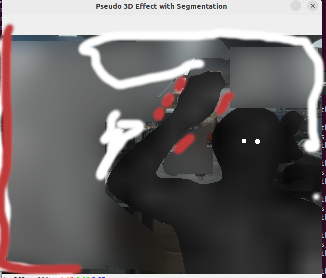

# cgmodeler
- Japanese CG person modeler who is utilized such a broadcasting
- train person action after train

# File treehttps://myoctocat.com/assets/images/base-octocat.svg
```
Root
├── data
├── models
└── scripts
```

# Scripts
1. Creating base person data
```
python segmentation.py
```
- generated json files in the data directory

2. Training
```
python training.py
```

3. Demo program
```
python realtime_demo.py
```
> [!NOTE]
> If you want to execute scripts at the root directory, command line as below
> python scripts/xxx.py

# sample Image 


